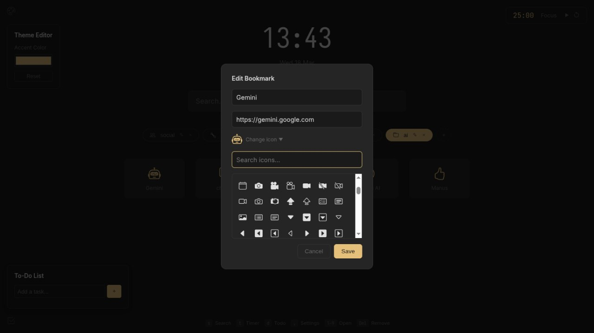

# ZenStation

A cozy, minimalist startpage for your browser with bookmarks, search, Pomodoro timer, to-do list, and theme customization.

## Features

- **Bookmark Groups** - Organize your favorite sites into custom groups with icons
- **Search Bar** - Quick search with engine prefixes (`!` for DuckDuckGo, `y` for YouTube, `r` for Reddit, `g` for GitHub)
- **URL Detection** - Enter URLs directly and they'll open without searching
- **Pomodoro Timer** - Built-in focus timer with visual countdown
- **To-Do List** - Track tasks with localStorage persistence
- **Theme Customization** - Choose your accent color
- **Keyboard Shortcuts**:
  - `s` - Focus search bar
  - `t` - Toggle timer
  - `d` - Toggle todo list
  - `,` - Open settings
  - `1-9` - Quick open bookmarks
  - `Esc` - Close modals

## Installation

### Chrome / Edge / Brave

1. Open `chrome://extensions` in your browser
2. Enable **Developer mode** (toggle in top-right)
3. Click **Load unpacked**
4. Select the folder containing this project

### Firefox

1. Open `about:debugging#/runtime/this-firefox`
2. Click **Load Temporary Add-on**
3. Select any file in this project folder (e.g., `manifest.json`)

Note: Firefox requires signed extensions for permanent installation. For development, use the temporary add-on method.

## Screenshots

### Customizable Accent Colors

### Functional Pomodoro Timer

### Functional To-Do List

### Customizable Icons

## Tech Stack

- Vanilla JavaScript (no frameworks)
- Bootstrap Icons
- LocalStorage for data persistence
- CSS Variables for theming
